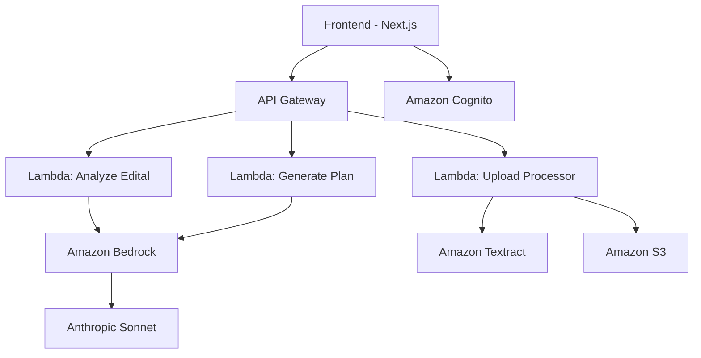

# StudyPlan AI 🎓

> Plataforma inteligente para criação de planos de estudo personalizados baseados em editais de concursos públicos


## 📖 Sobre o Projeto

O **StudyPlan AI** é uma aplicação educacional que revoluciona a forma como estudantes se preparam para concursos públicos. Utilizando inteligência artificial avançada, a plataforma analisa automaticamente editais de concursos e gera cronogramas de estudo personalizados, otimizados para maximizar o desempenho do candidato.

### 🎯 Problema que Resolve

- **Análise manual complexa**: Editais extensos e difíceis de interpretar
- **Planejamento ineficiente**: Dificuldade em priorizar matérias e distribuir tempo
- **Falta de personalização**: Planos genéricos que não consideram perfil individual
- **Desigualdade de acesso**: Nem todos têm recursos para cursos preparatórios especializados

## ✨ Funcionalidades

### 🔥 **Já Implementadas**
- ✅ **Interface Moderna**: Design responsivo e intuitivo
- ✅ **Sistema de Autenticação**: Login seguro com persistência de sessão
- ✅ **Dashboard Interativo**: Visualização de progresso e estatísticas
- ✅ **Configurações Personalizáveis**: Horas de estudo, dias da semana, preferências
- ✅ **Cronograma Visual**: Tabela semanal organizada por períodos
- ✅ **Gerenciamento de Matérias**: Seleção e priorização de disciplinas

### 🚀 **Em Desenvolvimento**
- 🔄 **Análise Inteligente de Editais**: Extração automática de matérias e pesos usando IA
- 🔄 **Geração de Cronogramas**: Planos otimizados baseados em algoritmos de IA
- 🔄 **Upload de PDFs**: Processamento de editais em formato PDF
- 🔄 **Análise de Progresso**: Métricas detalhadas e insights de desempenho
- 🔄 **Recomendações Adaptativas**: Ajustes automáticos baseados no progresso

### 📋 **Planejadas para o Futuro**
- 📅 **Integração com Calendário**: Sincronização com Google Calendar
- 📊 **Analytics Avançados**: Relatórios detalhados de desempenho
- 🔔 **Notificações Inteligentes**: Lembretes personalizados de estudo
- 👥 **Funcionalidades Sociais**: Grupos de estudo e ranking
- 📱 **Aplicativo Mobile**: Versão nativa para iOS e Android
- 🎯 **Simulados Integrados**: Sistema de questões e avaliações
- 🤖 **Tutor Virtual**: Assistente IA para dúvidas e orientações

## 🛠️ Tecnologias Utilizadas

### **Frontend**
- **Next.js 15.3.3** - Framework React com App Router
- **TypeScript** - Tipagem estática para maior robustez
- **Tailwind CSS** - Design system moderno e responsivo
- **Lucide React** - Ícones modernos e consistentes

### **Backend & Infraestrutura**
- **AWS Lambda** - Processamento serverless escalável
- **Amazon Bedrock** - IA para análise de texto e geração de conteúdo
- **API Gateway** - Gerenciamento de APIs RESTful
- **Amazon S3** - Armazenamento de arquivos (PDFs, uploads)
- **Amazon Cognito** - Autenticação e autorização de usuários
- **Amazon Textract** - OCR para extração de texto de PDFs

### **Ferramentas de Desenvolvimento**
- **AWS Amplify** - Deploy automático e CI/CD
- **Git/GitHub** - Controle de versão e colaboração
- **ESLint/Prettier** - Qualidade e padronização de código

## 🏗️ Arquitetura do Sistema



## 🚀 Como Executar Localmente

### **Pré-requisitos**
- Node.js 18+ instalado
- Conta AWS configurada
- Git instalado

### **Instalação**

```bash
# Clonar o repositório
git clone https://github.com/drdssouza/StudyPlan-AI.git
cd studyplan-ai

# Instalar dependências
npm install

# Configurar variáveis de ambiente
cp .env.example .env.local
# Edite .env.local com suas configurações

# Executar em modo de desenvolvimento
npm run dev
```

### **Configuração AWS (Opcional para desenvolvimento)**

```bash
# Instalar Amplify CLI
npm install -g @aws-amplify/cli

# Configurar Amplify
amplify configure

# Inicializar projeto
amplify init

# Adicionar autenticação
amplify add auth

# Deploy da infraestrutura
amplify push
```

## 📱 Screenshots

### Dashboard Principal


### Configuração de Plano


### Cronograma Semanal


*Nota: Screenshots serão adicionadas conforme o desenvolvimento avança*

## 🎯 Casos de Uso

### **Para Estudantes**
- Automatizar análise de editais complexos
- Receber planos de estudo otimizados
- Acompanhar progresso em tempo real
- Adaptar cronograma conforme necessidades

### **Para Educadores**
- Criar planos para turmas específicas
- Monitorar progresso de estudantes
- Otimizar distribuição de conteúdo

### **Para Instituições**
- Melhorar taxa de aprovação de alunos
- Padronizar metodologia de ensino
- Reduzir tempo de preparação de materiais

## 📊 Roadmap de Desenvolvimento

### **Fase 1 - MVP (Atual)**
- [x] Interface básica e autenticação
- [x] Configurações de usuário
- [ ] Análise básica de editais
- [ ] Geração de cronogramas

### **Fase 2 - IA Avançada**
- [ ] Análise semântica de editais
- [ ] Algoritmos adaptativos de cronograma
- [ ] Recomendações personalizadas

### **Fase 3 - Recursos Avançados**
- [ ] Simulados integrados
- [ ] Analytics avançados
- [ ] Funcionalidades sociais

### **Fase 4 - Expansão**
- [ ] Aplicativo mobile
- [ ] API pública
- [ ] Marketplace de conteúdo

## 📈 Métricas e Impacto

*Métricas serão adicionadas conforme o projeto evolui*

- **Usuários Ativos**: - (em desenvolvimento)
- **Editais Analisados**: - (em desenvolvimento)
- **Planos Gerados**: - (em desenvolvimento)
- **Taxa de Aprovação**: - (em desenvolvimento)

## 📄 Licença

Este projeto está sob a licença **MIT**. Veja o arquivo [LICENSE](LICENSE) para mais detalhes.

## 📞 Contato

**Desenvolvedor**: Eduardo Schrotke 
**Email**: eduardoschrotke@gmail.com  
**LinkedIn**: [Seu LinkedIn](https://www.linkedin.com/in/eduardo-schrotke/)  

---

## 🙏 Agradecimentos

- **Anthropic** - Pela tecnologia Claude que potencializa a IA do projeto
- **AWS** - Pela infraestrutura cloud robusta e escalável
- **Vercel** - Pelo excelente framework Next.js
- **Comunidade Open Source** - Pelas bibliotecas e ferramentas incríveis

---

<div align="center">

**⭐ Se este projeto te ajudou, não esqueça de dar uma estrela!**


</div>